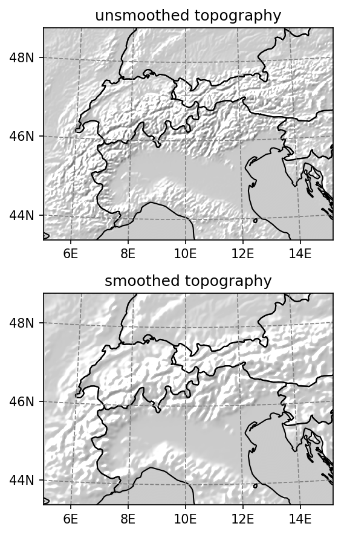

# acquire_topography
 script name: act.py
 author	    : Johannes Horak
 
A script that generates an upscaled topography of a region from a high resolution DEM

# description:
act.py is a script that may be used to generate a digital elevation model (DEM) in lambert conformal projection for downscaling purposes for a specified region of the world with a uniform horizontal grid spacing. If so desired topographic smoothing may be applied by using the additional option --smooth. See filter_topo for more details. Currently only DEMs with a minimum grid spacing of 1' may be	generated.

All parameters required are entered via the command line.

The output netcdf file will contain longitude and latitude coordinates in the variables XLONG_M and XLAT_M, as well as easting and northing (x,y), and the topography in the variable HGT_M. If smoothing is selected then the unsmoothed topography will be accessible via the variable HGT_O. Additionally the script generates a simplified landmask in the variable LANDMASK. Everything with elevation zero is considered as ocean (0) and everything above as land (1).

# some examples:
    python act.py --lat1=45 --lat2=48 --lat0=48 --lonc=10 --nx=205 --ny=150 --dx 4000 --dy 4000 --name europe --smooth
generates a smoothed DEM for the European Alps with a horizontal grid spacing of 4000x4000 m². See ./examples/european_alps.nc for the generated netcdf file.

    python act.py --lat1=-42 --lat2=-46 --lat0=-43.6 --lonc=170 --nx=205 --ny=225 --dx 4000 --dy 4000 --name southern_nz
generates a DEM of the South Island of New Zealand with a horizontal grid spacing of 4000x4000 m².

# requirements:
The ETOPO1 DEM is required to be placed in the [script-dir]/data directory in the NETCDF format. It may be downloaded from https://www.ngdc.noaa.gov/mgg/global/global.html. Adjust the filename of the ETOPO1-Ice DEM accordingly by changing	the value of the variable ETOPO1I_FN.

# packages required:
xarray, numpy, scipy, matplotlib (for debug or preview plots), salem, bunch, getopt
